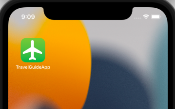
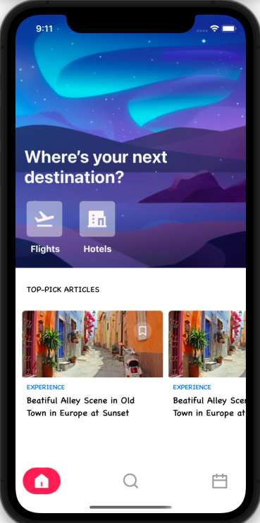
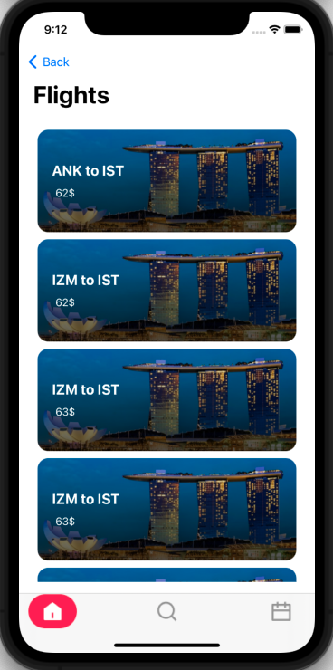
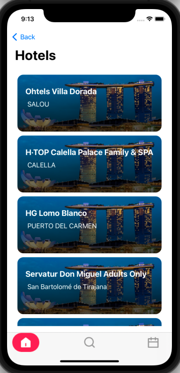
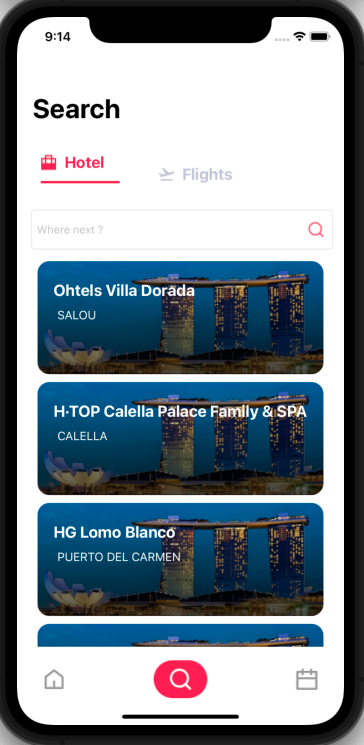
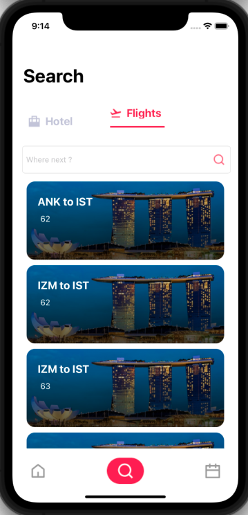
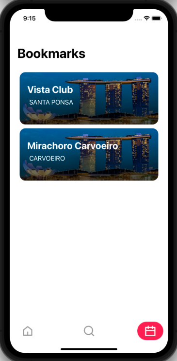

# FMSS IOS Bootcamp Bitirme Projesi

## Özet

- Ana ekranda, Flights ve Hotels adında iki buton bulunur.
- Bu butonlara tıklanıldığında ilgili butonun sayfası açlır.
- İlgili sayfalardaki veriler API'den listelenmektedir.
- Ana ekrandaki 'Top-Pick Articles Bölümü horizantal collection view ile oluşturulmuştur. 
- Altta bir tab bar ve üç adet tab bulunur. 
- Ortadaki tab arama ekranını açar
    - Arama ekranında iki ayrı bölüm vardır flights ve hotels ayrı ayrı listelenir.
    - Yine bu veriler API'den gelmektedir.
- En sağdaki bar Bookmarks sayfasını açar.
    - Bookmarks sayfasında kaydedilen oteller listelenir.
    - Bu oteller Core Data ile kaydedilmiştir.
---

    

    </img>

----

    

    </img>
    </img></img>
    </img></img>
    </img>

---

## Tools
- Swift
    - MVVM Design Pattern
    - Alamofire
    - Core Data
- UIKit
    - TabBar 
    - Navigation Controller 
    - Table View
    - Collection View
- Network
    - Hotel API   ->  https://developer.hotelbeds.com/documentation/getting-started/
    - Flight API  ->  https://rapidapi.com/Travelpayouts/api/flight-data/